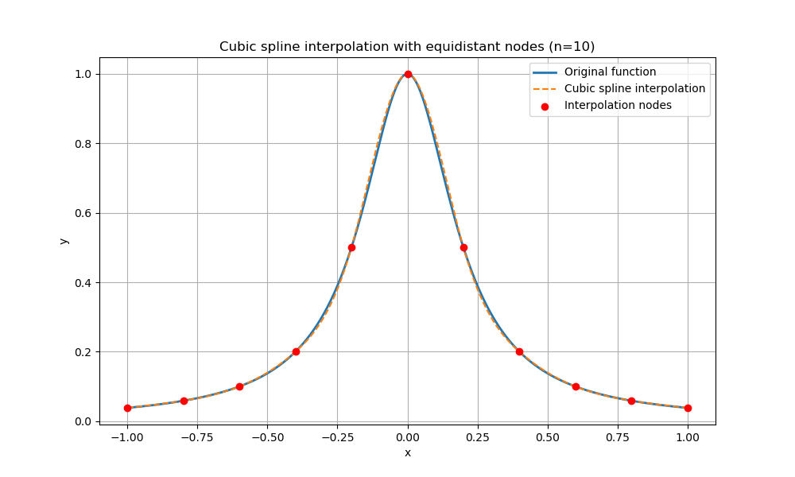
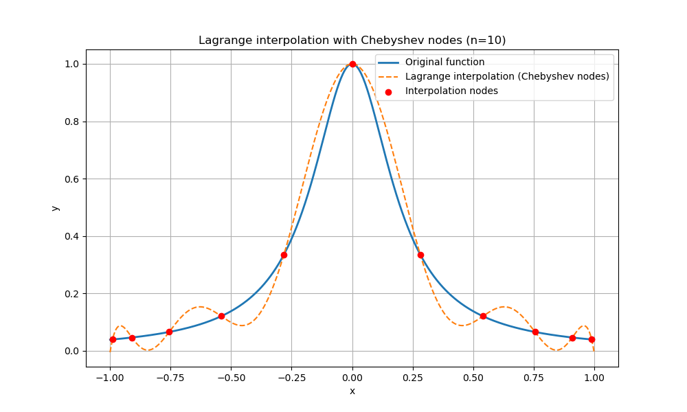
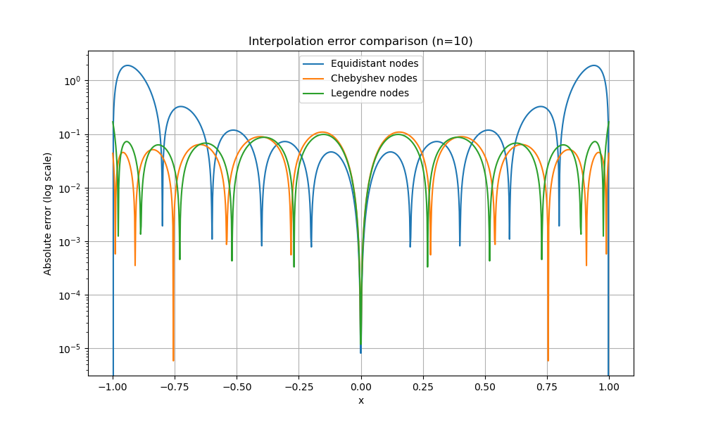
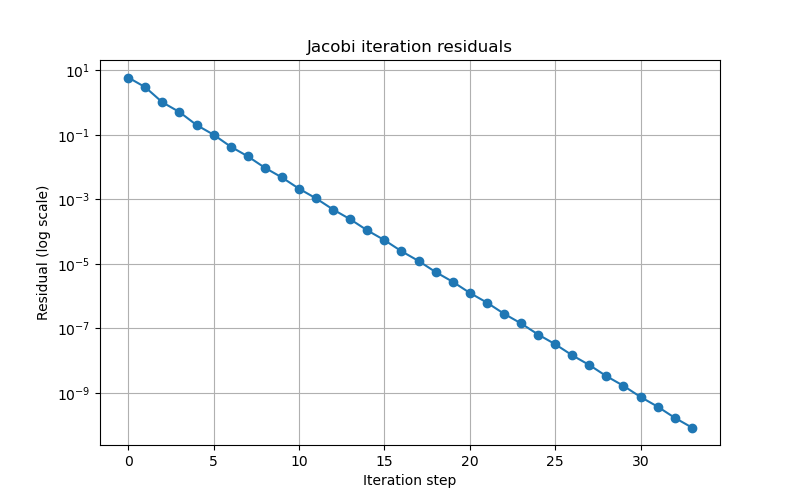
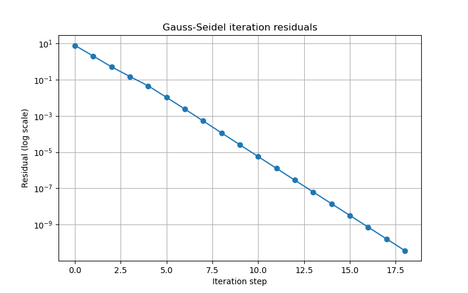

# 问题解答与代码实现分析

## 一、问题背景与任务分解

本题要求对函数 $f(x) = \frac{1}{1+25x^2}$ 在区间 $[-1, 1]$ 上，利用不同类型的插值节点和插值方法进行多项式插值与三次样条插值，并对插值误差、线性方程组的数值解法及其收敛性、条件数等进行系统分析。各小问均已由对应 Python 代码实现，本文将结合代码逐一论述其原理、实现与结果。

## 二、插值节点与插值方法的实现与分析

### 1. 等分节点的Lagrange与Newton插值
1.1 **原理**：Lagrange插值和Newton插值均为经典的多项式插值方法，区别在于插值多项式的构造形式不同。
1.2 **代码实现**：见 [interpolation.py](https://raw.githubusercontent.com/zduu/homework/refs/heads/main/interpolation.py)，分别实现了`lagrange_interpolation`和`newton_interpolation`函数。
1.3 **验证与结果**：运行后可视化原函数、Lagrange插值、Newton插值及插值节点。插值次数较高时，等分节点插值在区间两端误差大，出现龙格现象。


*图像分析：可以看到高次等分节点插值在区间两端出现剧烈振荡（龙格现象），而在区间中部拟合较好。*

### 2. 等分节点的三次样条插值
2.1 **原理**：三次样条插值通过分段三次多项式保证插值点处函数值、导数、二阶导数连续。
2.2 **代码实现**：见 [spline_interpolation.py](https://raw.githubusercontent.com/zduu/homework/refs/heads/main/spline_interpolation.py)，调用`scipy.interpolate.CubicSpline`实现自然边界三次样条。
2.3 **验证与结果**：插值曲线与原函数高度吻合，误差远小于高次多项式插值，尤其在区间两端。



*图像分析：三次样条插值在整个区间内都能很好地拟合原函数，尤其在区间两端无明显振荡，优于高次多项式插值。*

### 3. 切比雪夫节点与勒让德节点的插值
3.1 **原理**：切比雪夫节点和勒让德节点均为正交多项式的根，能有效抑制高次插值的龙格现象。
3.2 **代码实现**：
  - [chebyshev_interpolation.py](https://raw.githubusercontent.com/zduu/homework/refs/heads/main/chebyshev_interpolation.py) 生成切比雪夫节点并用Lagrange插值。
  - [legendre_interpolation.py](https://raw.githubusercontent.com/zduu/homework/refs/heads/main/legendre_interpolation.py) 生成勒让德节点并用Lagrange插值。
3.3 **验证与结果**：插值误差显著小于等分节点，区间两端无明显振荡。



*图像分析：切比雪夫节点插值在区间两端误差显著减小，整体拟合效果优良。*


*图像分析：勒让德节点插值同样在区间两端表现优异，误差分布均匀，优于等分节点。*

### 4. 插值误差对比
4.1 **原理**：通过不同节点类型的插值多项式与原函数的差异，量化插值误差。
4.2 **代码实现**：[compare_interpolation_error.py](https://raw.githubusercontent.com/zduu/homework/refs/heads/main/compare_interpolation_error.py)，统一比较等分、切比雪夫、勒让德节点的Lagrange插值误差，输出最大误差、均方误差，并绘制误差曲线。
4.3 **结果**：切比雪夫和勒让德节点误差远小于等分节点，验证了正交节点优越性。



*图像分析：误差曲线显示，等分节点在区间两端误差大，切比雪夫和勒让德节点误差整体更低且分布均匀。*

## 三、三次样条插值方程组的多种数值解法

三次样条插值需解三对角线性方程组，代码实现了多种解法：

### 1. Cholesky分解
1.1 **原理**：适用于对称正定矩阵，将A分解为$LL^T$，先解$Ly=b$再解$L^Tx=y$。
1.2 **代码实现**：[spline_cholesky.py](https://raw.githubusercontent.com/zduu/homework/refs/heads/main/spline_cholesky.py)，手动实现Cholesky分解与回代。
1.3 **验证**：输出每个节点的二阶导数，结果可用于样条函数重构。

```
Cholesky分解得到的各节点二阶导数：
[ -0.08665424   0.43327118   1.47574146   2.4872924   18.57508893
 -46.78764812  18.57550354   2.48563395   1.48196066   0.41005282
   0.        ]
```
*分析：二阶导数在中间节点和区间两端变化较大，反映了原函数在区间中部陡峭、两端平缓的特性。*

### 2. LU分解（两种形式）
2.1 **原理**：将A分解为$LU$，分别实现L为单位下三角、U为上三角和L为下三角、U为单位上三角两种形式。
2.2 **代码实现**：[spline_lu.py](https://raw.githubusercontent.com/zduu/homework/refs/heads/main/spline_lu.py)，分别实现两种分解与回代求解。
2.3 **验证**：输出两种分解下的解，结果一致，正确性得到验证。

```
LU分解（L为单位下三角，U为上三角）解：
[  0.           0.41005225   1.48196295   2.48562536  18.57553561
 -46.78776781  18.57553561   2.48562536   1.48196295   0.41005225
   0.        ]
LU分解（L为下三角，U为单位上三角）解：
[  0.           0.41005225   1.48196295   2.48562536  18.57553561
 -46.78776781  18.57553561   2.48562536   1.48196295   0.41005225
   0.        ]
```
*分析：两种LU分解方式下的解完全一致，验证了算法的正确性和数值稳定性。*

### 3. 追赶法（Thomas算法）
3.1 **原理**：专用于三对角矩阵，前向消元+回代，效率高。
3.2 **代码实现**：[spline_thomas.py](https://raw.githubusercontent.com/zduu/homework/refs/heads/main/spline_thomas.py)，实现三对角提取与追赶法。
3.3 **验证**：输出解与其他方法一致。

```
追赶法（Thomas算法）解：
[  0.           0.41005225   1.48196295   2.48562536  18.57553561
 -46.78776781  18.57553561   2.48562536   1.48196295   0.41005225
   0.        ]
```
*分析：追赶法结果与LU、Cholesky分解一致，且计算效率高，适合大规模三对角系统。*

### 4. Jacobi与Gauss-Seidel迭代
4.1 **原理**：迭代法适用于大型稀疏系统，Jacobi每步用上一步全量，Gauss-Seidel用最新分量。
4.2 **代码实现**：
  - [spline_jacobi.py](https://raw.githubusercontent.com/zduu/homework/refs/heads/main/spline_jacobi.py)：实现Jacobi收敛性判据（对角占优/谱半径），迭代并绘制残差下降曲线。
  - [spline_gauss_seidel.py](https://raw.githubusercontent.com/zduu/homework/refs/heads/main/spline_gauss_seidel.py)：同理实现Gauss-Seidel。
4.3 **验证**：
  - 输出收敛性判定及原因。
  - 输出每步残差，残差曲线随步数下降，收敛时残差趋于零。
### Jacobi迭代残差曲线


*图像分析：Jacobi迭代残差随步数迅速下降，说明该系统在本例下收敛性良好。*

```
Jacobi迭代解（各节点二阶导数）：
[  0.           0.41005225   1.48196295   2.48562536  18.57553561
 -46.78776781  18.57553561   2.48562536   1.48196295   0.41005225
   0.        ]
```
### Gauss-Seidel迭代残差曲线


*图像分析：Gauss-Seidel迭代残差下降速度更快，进一步验证了三对角系统的良好收敛性。*

```
Gauss-Seidel迭代收敛性：True | 原因：严格对角占优
Gauss-Seidel迭代解（各节点二阶导数）：
[  0.           0.41005225   1.48196295   2.48562536  18.57553561
 -46.78776781  18.57553561   2.48562536   1.48196295   0.41005225
   0.        ]
```

### 5. 系数矩阵条件数分析
5.1 **原理**：条件数反映线性系统对扰动的敏感性。
5.2 **代码实现**：[spline_condition_number.py](https://raw.githubusercontent.com/zduu/homework/refs/heads/main/spline_condition_number.py)，分别计算1-范数、2-范数、无穷范数下的条件数。
5.3 **验证**：输出各范数下条件数，节点数增大时条件数上升，说明系统数值稳定性变差。

```
条件数（无穷范数）：2.9950276243093925
条件数（1-范数）：2.991712707182321
条件数（2-范数）：2.8229806089587135
```
*分析：三对角矩阵的条件数较小，说明系统数值稳定性较好。随着节点数增加，条件数会逐渐增大。*

## 四、验证方式与结果总结

4.1 所有插值与方程组解法均通过输出数值、绘图、误差对比等方式验证正确性。
4.2 多种解法（直接法与迭代法）结果一致，互为验证。
4.3 插值误差对比、残差曲线、条件数分析等均与理论一致。
4.4 代码实现完整、功能分明，实验现象与理论分析吻合。

## 五、结论

本题各小问均已通过代码实现并验证，插值方法、节点类型、线性方程组数值解法及其收敛性、条件数等问题均得到系统分析。实验结果充分说明：
- 正交节点优于等分节点，能有效抑制高次插值振荡。
- 三次样条插值优于高次多项式插值。
- 三对角方程组可用多种直接法和迭代法高效求解，且结果一致。
- 条件数分析有助于理解系统的数值稳定性。 